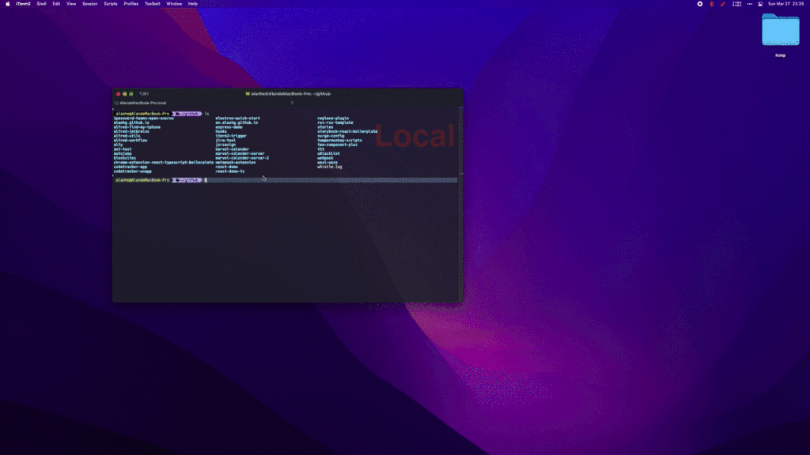

> iTerm2终端下点击不同文件时，执行不同动作。🚀



## 当前效果
点击文件/文件夹
- 如果文件夹中包含JS/TS/MD文件则使用`WebStorm`打开
- 如果文件夹包含GO文件，则使用`GoLand`打开
- 如果文件是JS/TS，则提供`下拉菜单【VSC/WS】`，用户手动选择中打开IDE
- 如果以上IDE未安装，则进行下一规则匹配
- 兜底逻辑未使用系统默认程序打开，比如finder或者VSC等

针对以上规则在`iterm2-trigger.js:ruleMap`下进行个性化定制修改

## 安装配置

```shell
chmod +x iterm2-trigger.sh
```


## 测试
```
node ./iterm2-trigger.js "$PWD/iterm2-trigger.js"

```
